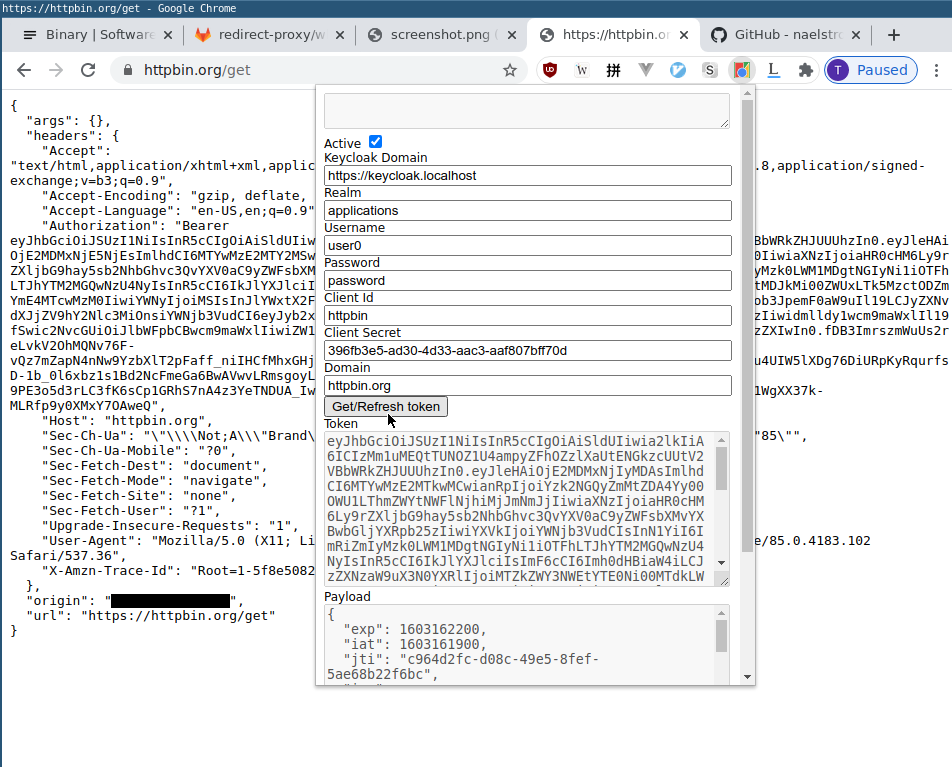

# auth-helper-extension

For developers!

This allows you to manually get an access token from an OAuth Authorization
Server (only Keycloak for now) and inject it as an `Authorization` header!



This extension also helpfully

+ Provides an access token for you to copy and paste elsewhere
+ Decodes (without verification) the access token for you
+ Prints `exp` and `iat` in a human-readable format

## Usage

Clone this repo, and load it in Chrome with "Load Unpacked Extension".

Configure the extension in the popup (See screenshot)

To use it with a given application (OAuth2 client/Keycloak client), the
Keycloak client has to be configured with "Direct Access Grants Enabled". This
should be okay if you're only using it for development purposes.

### Fields

+ Keycloak Domain
  + Where your keycloak server is. Please include `https://`. The extension
    will make a request to

  ```
  const url = `${keycloakDomain}/auth/realms/${realm}/protocol/openid-connect/token`;
  ```
+ Realm
  + The realm your application/Keycloak client is configured in
+ Username/password
  + The username/password of the user you want to sign into your application as
  + We're actually using the OAuth2 Resource Owner Credentials Grant to get a
    token here
+ Client Id/Secret
  + The client credentials of the Keycloak client you're getting a token for
  + The OAuth2 Resource Owner Credentials Grant requires authentication for the
    client if the client is a confidential client
  + This should be okay for development purposes
+ Domain
  + This is the domain (regex) that you want the injection to take place on
  + Here's what I'm using to check for matches
  ```
  if (url.match(domain) === null) {
    // Don't inject header
  }
  ```
